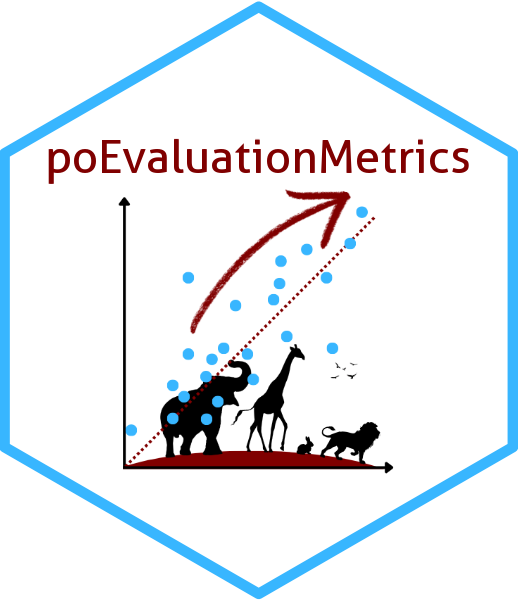

# poEvaluationMetrics 

R package for evaluating species distribution models (SDMs): discrimination metrics (AUC, correlation, PRG), calibration-style error (MAE, bias), Boyce-type Spearman indices (`SBI_*` via smoothed GAMs), and threshold-based scores (TSS, Kappa, omission, F1-style **Fbp**, SEDI, ORSS, etc.).

## Install

Dependencies (beyond CRAN defaults) include **terra**, **sf**, **CAST**, **predicts**, **mecofun**, **PresenceAbsence**, **prg**, and **Metrics**. Some must be installed from GitHub / Git:

```r
install.packages(c("remotes", "devtools"))

# PRG package (GitHub)
remotes::install_github("meeliskull/prg/R_package/prg")

# mecofun (GitLab)
remotes::install_git("https://gitup.uni-potsdam.de/macroecology/mecofun.git")
```

Then install **poEvaluationMetrics** (install any other missing packages from CRAN with `install.packages` as needed):

```r
remotes::install_github("envima/poEvaluationMetrics")
```

Vignette: after installation, see `vignette("poEvaluationMetrics", package = "poEvaluationMetrics")`.

## Citation

After installing the package:

```r
citation("poEvaluationMetrics")
```

Or cite the `inst/CITATION` entry when reporting methods.

## Usage

**High-level:** run one or more evaluation designs (presence–absence, presence–background with sampled background, presence–artificial-absence via AOA) with optional replication for PBG/PAA. **`presence` is required** (no default).

```r
library(poEvaluationMetrics)

result <- performanceEstimation(
  prediction = prediction_raster,           # terra::SpatRaster
  presence = presence_sf,                   # sf — required
  absence = absence_sf,                     # or FALSE to skip PA
  background = TRUE,                        # or FALSE, or an sf object
  aa = TRUE,                                # PAA via CAST::aoa; FALSE to skip
  environmentalVariables = env_rasters,    # needed if background or aa is TRUE
  noPointsTesting = 1000,                   # defaults to nrow(presence)
  replicates = 50                           # mean over replicates for PBG/PAA
)

# One row per scenario; use the `scenario` column (PA / PAA / PBG)
result[result$scenario == "PBG", ]
```

**Single map + one set of absence/background points:**

```r
df_metrics <- calculateMetrics(prediction_raster, presence_sf, background_or_absence_sf)
```

**Tabular data only** (continuous predictions + binary `observed`, plus a raster for Boyce/SBI sampling):

```r
tab <- data.frame(predicted = c(0.2, 0.8, 0.1), observed = c(0L, 1L, 0L))
indexCalculation(tab, prediction_raster)
```

**Standalone helpers** (binary classifications for most): `Fbp()`, `sedi()`, `orss()`, `omission()`, `brier_score()`, `fowlkes_mallows()`, `mcc()`, `tcr()`. See `?Fbp` and other help pages.

## Documentation website (pkgdown)

Configure the site URL in `_pkgdown.yml` if it differs from the default. Build locally:

```r
install.packages("pkgdown") # if needed
pkgdown::build_site()
```

## Development

```r
devtools::document()
devtools::check()
```

## License

Released under the [MIT license](LICENSE) (`License: MIT + file LICENSE` in `DESCRIPTION`). The package is distributed via GitHub, not CRAN.
